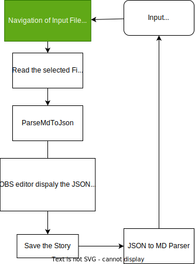
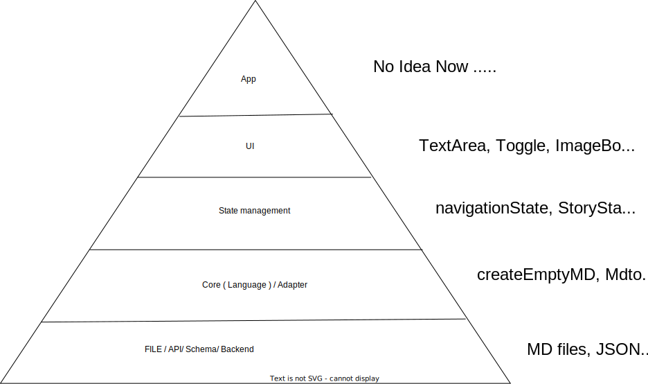

# Open Bible Stories

## Overview

This library can be used for Editing and Displaying the OBS content.

### Tech stack

This library uses:

-   React JS: For user interface
-   Pure JS: For core functions and Hooks
-   Vite: For running a sandbox for dev
-   Styleguidist: For demoing the library

### Links

[styleguide](open-bible-stories.netlify.app/)

### User Interfaces

-   EditorPanel: Displays and edits the content of one OBS story.

### Custom Hooks

-   useStory: Handles the states of a single story and provide the actions for the OBS single story.

### Core Functions

-   mdTojson: Parses the OBS md string into a story json objects.
-   jsonTomd: Parses the story JSON object to the OBS story md string.

## How to Run the Application

1. Clone the repo:

```bash
https://github.com/vipinpaul/open-bible-stories
```

2. Install the dependencies using Yarn - `yarn install`
3. Start the development mode
    - Get into styleguidist - `yarn start`
    - Get into Vite - `yarn dev`

## How to Use the Library from NPM

-   Install the Library from: https://www.npmjs.com/package/open-bible-stories
-

### Diagrams

#### Flow Diagram



#### Layers Diagram



#### Architecture Diagram (ToDo)
